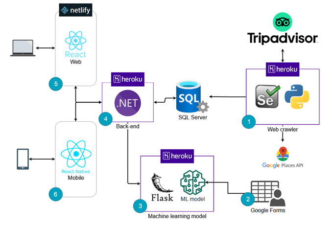

<h1 align='center'>
  
</h1>

  <a href="#book-about">About</a>&nbsp;&nbsp;&nbsp;|&nbsp;&nbsp;&nbsp;
  <a href="#%EF%B8%8F-technologies">Technologies</a>&nbsp;&nbsp;&nbsp;|&nbsp;&nbsp;&nbsp;
  <a href="#cityscape-solution-architecture">Solution architecture</a>&nbsp;&nbsp;&nbsp;|&nbsp;&nbsp;&nbsp;
  <a href="#-running-the-api">Running the API</a>

  
  
  

## :book: About
This is the API of IAe, Bora? project and it was developed with .NET 5 and C#.

The IAe, Bora? project is a recommendation system solution for tours and events in Grande ABC (São Paulo, Brazil) region using the concepts of artificial intelligence, machine learning models and recommendation systems, able to recommend places in the region according to the user profile, based on the answers of a questionnaire answered by the users.

## ⚒️ Technologies
- [.NET 5](https://docs.microsoft.com/pt-br/dotnet/core/dotnet-five)
- [C#](https://docs.microsoft.com/pt-br/dotnet/csharp/)
- [RestSharp](https://restsharp.dev/)
- [Entity Framework Core](https://docs.microsoft.com/pt-br/ef/core/)
- [GeoCoordinate](https://github.com/ghuntley/geocoordinate)
- [ViaCep](https://viacep.com.br/)
- [Swagger](https://swagger.io/)

## :cityscape: Solution architecture
This repository is represented by the number 4 in the architecture, if you want to view the other repositories of the solution, click on one of the items below:

  

- [(1) Web Crawler](https://github.com/iae-bora/abc-tourism-crawler)
- [(3) Machine Learning](https://github.com/iae-bora/ml-api)
- [(5) Front-End](https://github.com/iae-bora/front-end)
- [(6) Mobile](https://github.com/iae-bora/mobile)

## 🚀 Running the API

- Install the dependencies with `dotnet add package`
- Start the server with `dotnet run`

It will open the swagger home page in **https://localhost:44393/swagger/index.html**, then you can read the API documentation and make requests to all endpoints.
